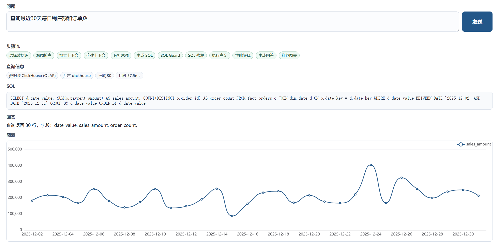
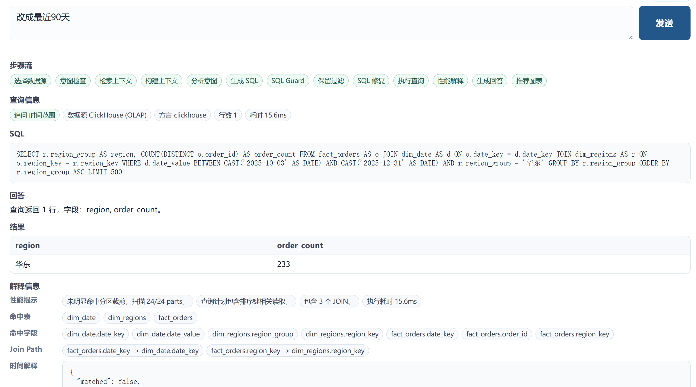
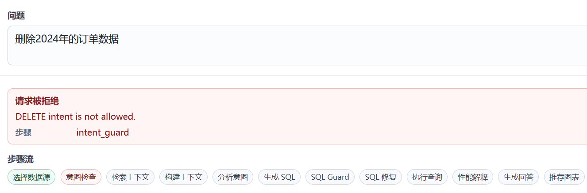
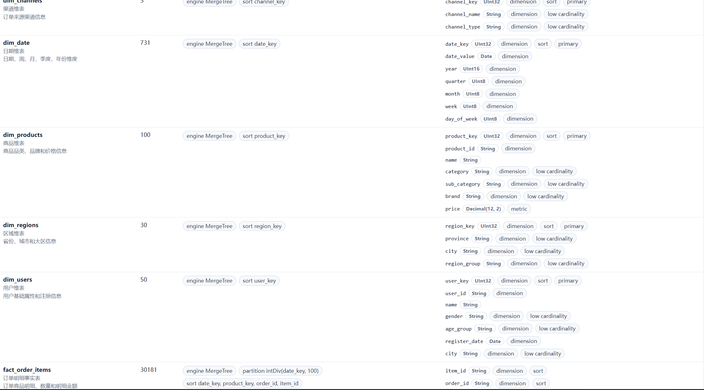

# Industrial NL2SQL Data Agent Platform

面向 OLAP 数据仓库的工业级 NL2SQL 数据分析智能体平台。

## 项目主题

本项目不是金融分析助手，也不是单一业务 Demo，而是一个面向企业经营分析和 OLAP 数仓场景的通用 NL2SQL 平台。

第一阶段采用：

- DuckDB 作为本地 OLAP 数据库。
- 示例电商数仓数据集作为演示和评测数据。
- FastAPI + Vue 作为前后端架构。
- LangGraph 编排 NL2SQL 查询链路。
- SQLGlot 构建 SQL Guard。

后续阶段扩展：

- ClickHouse 数据源。
- DuckDB / ClickHouse 方言适配。
- OLAP 查询性能治理。
- MCP 工具化。

## 一句话定位

基于 FastAPI、LangGraph、SQLGlot 和 DuckDB/ClickHouse 构建的工业级 NL2SQL Data Agent，支持元数据语义层、指标口径管理、SQL 安全治理、执行反馈修复、自动可视化和评测闭环。

## 第一阶段数据域

使用电商数仓作为示例业务域，覆盖典型 OLAP 分析场景：

- 销售分析：销售额、订单数、客单价、同比、环比。
- 用户分析：新增用户、活跃用户、复购率、留存。
- 商品分析：品类销售额、SKU 销量、毛利率、TopN。
- 渠道分析：渠道销售额、转化率、ROI。
- 区域分析：省份、城市、大区贡献。
- 时间分析：日、周、月、季度趋势。

建议第一版数据模型：

```text
fact_orders
fact_order_items
fact_user_events
dim_users
dim_products
dim_regions
dim_channels
dim_date
```

## 当前 Scope

- DuckDB 本地数据源。
- 电商数仓示例数据生成。
- 元数据同步。
- DB-backed 语义层、指标、别名、Analysis Space 和 Verified Queries。
- 规则检索和 focused schema context。
- NL2SQL Agent 工作流。
- SQL Guard。
- 只读 SQL 执行。
- SSE 查询步骤流。
- 表格和图表展示。
- Eval Runner。
- Qdrant 向量召回、Value Recall 和向量/规则对比评测。
- MCP 只读工具化：schema、Guarded SQL、EXPLAIN 和指标检索。

## 快速启动

### Docker Compose 一键启动

完整演示栈包含 ClickHouse、后端和前端。首次启动会自动生成 DuckDB 数据集、导出 ClickHouse CSV、初始化 ClickHouse 数据、同步 DuckDB/ClickHouse metadata。

```bash
docker compose up --build
```

访问：

```text
Frontend: http://127.0.0.1:5174/
Backend:  http://127.0.0.1:8000/api/health
```

默认使用 `LLM_PROVIDER=mock`，不需要 API key。需要重置演示数据时：

```bash
docker compose down -v
docker compose up --build
```

如果本机已经占用 `8123`、`9000`、`8000` 或 `5174` 端口，需要先停止对应服务或调整 `docker-compose.yml` 端口映射。

Qdrant 也已放入 compose，但默认不启动。需要单独启动向量数据库时：

```bash
docker compose --profile vector up -d qdrant
```

完整启用向量召回仍需要配置 embedding 模型、安装后端 `vector` extra 并将后端 `VECTOR_ENABLED=true`。默认 Compose 演示栈保持关闭，避免拉取较重的 embedding 依赖。

### 本地开发启动

WSL/Ubuntu 建议把 Python 虚拟环境放在 Linux 文件系统里，不要放在 `/mnt/c` 或 `/mnt/d`：

```bash
python3 -m venv ~/.venvs/nl2sql-pro
source ~/.venvs/nl2sql-pro/bin/activate
python -m pip install --upgrade pip
python -m pip install -e "backend[test]"
```

如果仓库位于 `/mnt/c` 或 `/mnt/d`，npm、pytest、DuckDB/SQLite I/O 会明显变慢；长期开发建议把仓库克隆或同步到 WSL 的 ext4 目录，例如 `~/src/nl2sql_pro`。
也可以先把本地数据文件放到 WSL ext4，在 `backend/.env` 中配置：

```env
DUCKDB_PATH=/home/hao/.local/share/nl2sql_pro/ecommerce.duckdb
SQLITE_PATH=/home/hao/.local/share/nl2sql_pro/metadata.sqlite
```

生成本地 DuckDB 数据并同步元数据：

```bash
python scripts/generate_ecommerce_data.py
python scripts/sync_metadata.py
```

启动后端：

```bash
python -m uvicorn backend.app.main:app --host 127.0.0.1 --port 8000
```

启动前端：

```bash
cd frontend
npm install --cache .npm-cache --prefer-online
npm run dev
```

访问：

```text
http://127.0.0.1:5174/
```

## 向量索引

Phase 4 使用 Qdrant 作为向量数据库，embedding 模型必须显式配置，不做隐式 fallback。

向量能力依赖较重，按需安装：

```bash
python -m pip install torch --index-url https://download.pytorch.org/whl/cpu
python -m pip install -e "backend[vector]"
```

本地开发建议使用项目 Compose 启动 Qdrant：

```bash
docker compose --profile vector up -d qdrant
```

后端 `.env` 示例：

```env
VECTOR_ENABLED=true
QDRANT_URL=http://localhost:6333
QDRANT_COLLECTION_PREFIX=nl2sql
EMBEDDING_MODEL=/mnt/d/Models/BAAI/bge-m3
```

重建索引：

```bash
python scripts/rebuild_vector_index.py
```

也可以在前端管理页的“向量索引”Tab 查看状态并触发重建。

## Phase 1 Demo 问题

推荐演示：

- 查询最近30天每日销售额和订单数
- 按地区统计最近30天销售额
- 按渠道统计最近30天销售额
- 最近30天销量最高的10个商品
- 按品类统计最近30天销售额

安全拦截演示：

- 删除2024年的订单数据
- DROP fact_orders
- 创建一张临时订单表

危险 SQL 会被 SQL Guard 阻断，前端会展示拒绝阶段和原因。

## Smoke Eval

运行 Mock 基线回归：

```bash
python scripts/run_smoke_eval.py
```

当前 smoke eval 覆盖：

- DuckDB 51 条基线、OLAP 和多轮追问 case：趋势、地区、渠道、商品 TopN、品类、客单价、复购率、时间段对比、占比、同比/环比、移动平均、多轮指标/过滤/时间切换、指标/别名检索、fallback、Value Recall、语义向量召回、安全拦截和修复链路
- ClickHouse 25 条方言和 OLAP case：日期函数、条件聚合、`uniqExact` / `sumIf` / `countIf`、OLAP TopN、占比、同比/环比、移动平均、EXPLAIN 性能提示，以及 ClickHouse 特有危险命令/函数拦截
- retrieval、focused context、SQL Guard、只读执行器、query-level explainability、chart recommendation、OLAP intent / SQL pattern / chart / plan-hint 回归
- 错误归因：retrieval_miss、sql_generation_error、sql_generation_timeout、sql_generation_mismatch、dialect_mismatch、sql_invalid、guard_blocked、fanout_risk、guard_mismatch、execution_error、result_mismatch、chart_mismatch、explainability_error、explainability_mismatch

通过时输出类似：

```text
51/51 smoke cases passed.
DuckDB (本地) - 51 cases: 51/51 passed.
skipped 25 cases for provider=mock.
focused context: avg=1842 chars, full=7345 chars, avg_reduction=74.9%, fallback=4/51
report: evals\reports\smoke_latest.md
```

报告会写入 `evals/reports/smoke_latest.md`，包含 provider、skipped cases、按数据源分组的通过率、Phase 6.5 OLAP 命中率、错误类型分布、retrieval expected hit rate、full schema vs focused context 对比、每条 case 的 SQL、检索资产和失败详情。ClickHouse 未启用或不可连接时，ClickHouse case 会自动跳过。

运行 DeepSeek real eval：

```bash
python scripts/run_smoke_eval.py --provider deepseek --report-path evals/reports/deepseek_latest.md
```

Real eval 需要配置 `DEEPSEEK_API_KEY`。显式 `--provider deepseek` 且缺少 key 时，runner 会直接报错退出；Mock eval 不需要 key。

运行规则检索和向量检索对比：

```bash
python scripts/run_smoke_eval.py --provider mock --vector-compare --report-path evals/reports/phase4_compare.md
```

`--vector-compare` 会分别执行 rule-only 和 rule+vector 两组。真正验证向量效果需要 Qdrant 已启动、`VECTOR_ENABLED=true` 且已重建索引。

## MCP Tools

Phase 7 提供两个 stdio MCP server，复用后端同一套 metadata service、SQL Guard、只读执行器和 datasource manager。MCP 进程不持有独立数据库凭据，也不暴露任何写工具。

安装 MCP extra：

```bash
python -m pip install -e "backend[mcp]"
```

可用工具：

```text
mcp_servers.db_tools
  list_tables
  get_table_schema
  query_readonly

mcp_servers.olap_tools
  explain_query
  metric_catalog_search
```

本地冒烟：

```bash
python scripts/run_mcp_smoke.py
```

示例 Claude Desktop / MCP client 配置（把 `command`、`cwd` 和 `PYTHONPATH` 改成你本机的虚拟环境与仓库路径）：

```json
{
  "mcpServers": {
    "nl2sql-db-tools": {
      "command": "/home/hao/.venvs/nl2sql-pro/bin/python",
      "args": ["-m", "mcp_servers.db_tools"],
      "cwd": "/home/hao/workspace/nl2sql_pro",
      "env": {
        "PYTHONPATH": "/home/hao/workspace/nl2sql_pro"
      }
    },
    "nl2sql-olap-tools": {
      "command": "/home/hao/.venvs/nl2sql-pro/bin/python",
      "args": ["-m", "mcp_servers.olap_tools"],
      "cwd": "/home/hao/workspace/nl2sql_pro",
      "env": {
        "PYTHONPATH": "/home/hao/workspace/nl2sql_pro"
      }
    }
  }
}
```

安全演示：

```text
query_readonly("DELETE FROM fact_orders WHERE order_id = 'O00000001'")
```

返回 `ok=true` 且 `data.allowed=false`、`stage=operation_guard`，并且不会调用执行器。

## Demo Evidence

- [Mock smoke eval report](evals/reports/smoke_latest.md)：51/51 mock regression cases passed，覆盖多轮追问 filter / metric / time persistence。
- [DeepSeek real eval report](evals/reports/deepseek_latest.md)：18/18 real cases passed，14/14 reference result matches。

### Query Workflow



### Multi-Turn Follow-Up

演示链路：

```text
最近30天销售额
按地区拆分
只看华东
换成订单数
改成最近90天
```

系统会把后续问题识别为追问，并在切换维度、过滤条件、指标和时间范围时保留其他约束。



### SQL Guard



### Semantic Layer Admin



更多截图见 [docs/assets/screenshots](docs/assets/screenshots/)：

- [TopN query with explainability](docs/assets/screenshots/query_top_products_explainability.png)
- [Verified queries admin](docs/assets/screenshots/admin_verified_queries.png)
- [Relationships admin](docs/assets/screenshots/admin_relationships.png)
- [ClickHouse channel sales query](docs/assets/screenshots/query_channel_sales_clickhouse.png)
- [Follow-up step 1: recent 30-day sales](docs/assets/screenshots/query_followup_step1_recent30_sales.png)
- [Follow-up step 2: region breakdown](docs/assets/screenshots/query_followup_step2_region_breakdown.png)
- [Follow-up step 3: East China filter](docs/assets/screenshots/query_followup_step3_filter_east.png)
- [Follow-up step 4: order count metric](docs/assets/screenshots/query_followup_step4_metric_order_count.png)
- [Follow-up step 5: recent 90-day time window](docs/assets/screenshots/query_followup_step5_time_90d.png)

## 当前限制

- Mock provider 只覆盖少量 verified/demo 问题，不是完整自然语言泛化能力。
- DeepSeek provider 已接入，real eval 会保存 generated SQL 和 normalized SQL；业务语义等价性仍需要人工审阅报告。
- SQL 高亮目前是基础代码块展示，未接入完整语法高亮。
- ECharts 当前覆盖 line、bar、pie、dual-axis 等常见 OLAP 推荐图表，更复杂的多维可视化仍使用表格 fallback。
- MCP 当前只暴露只读工具；语义资产 CRUD、profile_table、data_quality_check 和审计接口留作后续治理阶段。

## 暂不纳入 Scope

- 金融/股票分析插件。
- 训练专用 NL2SQL 模型。
- 多租户权限系统。
- 企业 SSO。
- 复杂 BI Dashboard 编辑器。
- MCP 写工具和完整治理工具生态。
- Elasticsearch 值召回。

这些能力可以后续扩展，但不进入第一版目标。

## 核心工程卖点

1. 面向 OLAP，而不是普通 CRUD 数据库。
2. 不直接执行 LLM 生成 SQL，所有 SQL 必须经过 SQL Guard。
3. 不把全量 schema 粗暴塞进 prompt，而是通过元数据和语义层构建上下文。
4. 查询链路可观测，前端展示步骤、SQL、结果和图表。
5. 通过 eval runner 量化准确率、安全拦截率、执行成功率和延迟。
6. 第一版轻量可运行，后续可平滑扩展 ClickHouse。

## 文档

- [INTERVIEW_PITCH.md](docs/INTERVIEW_PITCH.md)
- [ARCHITECTURE.md](docs/ARCHITECTURE.md)
- [SQL_GUARD_DESIGN.md](docs/SQL_GUARD_DESIGN.md)
- [METADATA_SEMANTIC_LAYER.md](docs/METADATA_SEMANTIC_LAYER.md)
- [EVALUATION_DESIGN.md](docs/EVALUATION_DESIGN.md)
- [AGENT_WORKFLOW.md](docs/AGENT_WORKFLOW.md)
- [NL2SQL_RESEARCH.md](docs/NL2SQL_RESEARCH.md)
- [ROADMAP.md](docs/ROADMAP.md)
- [Phase 3 Design](docs/superpowers/specs/2026-05-30-nl2sql-phase3-design.md)
- [Phase 4 Design](docs/superpowers/specs/2026-05-30-nl2sql-phase4-design.md)
