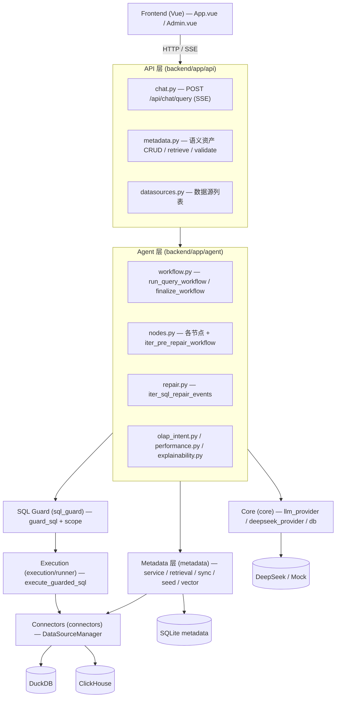

# 架构设计 — Industrial NL2SQL Data Agent Platform

> 本文档描述系统的整体架构、分层职责、安全边界和查询生命周期，作为项目技术架构的主文档。
> Demo 和操作路径见 `docs/DEMO_GUIDE.md`，路线图见 `docs/ROADMAP.md`。

## 1. 定位

面向 OLAP 数据仓库和企业经营分析的工业级 NL2SQL / Data Agent 平台。区别于"接一个大模型 API 生成 SQL"的 Demo，本项目把重心放在四件事：

- **语义层**：把业务上下文（表/字段/别名/指标口径/示例 SQL）落库，查询时只消费已同步、可审计的 metadata。
- **SQL 安全**：用确定性代码（而非 prompt）构成 SQL Guard，决定"系统敢不敢执行这条 SQL"。
- **可观测链路**：把查询拆成可流式、可修复的节点。
- **评测闭环**：用 eval runner 量化检索/生成/执行/安全表现。

技术栈：FastAPI + LangGraph 风格的节点编排 + DuckDB/ClickHouse + SQLite（metadata）+ SQLGlot（Guard）+ Vue 3。

## 2. 分层总览



依赖方向自上而下，单向无环。`config.py`（pydantic-settings）是所有层的横切配置源。

## 3. 分层职责与关键文件

| 层 | 目录 | 关键文件 | 职责 |
|----|------|---------|------|
| API | `api/` | `chat.py`、`metadata.py`、`datasources.py` | HTTP/SSE 边界；把 Agent 步骤序列化为 SSE 事件；语义资产 CRUD 与校验接口 |
| Agent | `agent/` | `workflow.py`、`nodes.py`、`repair.py`、`olap_intent.py`、`performance.py`、`explainability.py` | 查询编排：意图识别、上下文召回、SQL 生成、Guard、执行、修复、解释、图表 |
| SQL Guard | `sql_guard/` | `guard.py`、`scope.py`、`models.py` | 确定性安全边界：SQLGlot 解析、只读校验、表/字段白名单、自动 LIMIT、方言感知 |
| Execution | `execution/` | `runner.py` | 只读执行 guarded SQL，归一化结果（columns/rows/row_count/elapsed_ms） |
| Metadata | `metadata/` | `service.py`、`retrieval.py`、`sync.py`、`seed.py`、`models.py`、`hybrid.py`、`vector/*` | DB-backed 语义层：schema 同步、上下文构建、规则+向量混合检索、语义资产读写、断链校验 |
| Connectors | `connectors/` | `base.py`、`manager.py`、`registry.py`、`duckdb.py`、`clickhouse.py`、`schema.py` | 数据源抽象（Protocol）+ 注册表 + 方言；只读连接、EXPLAIN、schema introspection |
| Core | `core/` | `llm_provider.py`、`deepseek_provider.py`、`db.py` | LLM Provider 抽象与实现；DuckDB/SQLite 连接与 session |
| Config | `config.py` | — | 单一 `Settings`，数据源/LLM/向量/ClickHouse 开关 |
| Visualization | `visualization/` | `recommender.py` | 图表推荐（line/bar/dual_axis/pie/table fallback） |

## 4. 安全边界（架构的承重墙）

NL2SQL 的工业化关键不是"模型能生成 SQL"，而是"系统能否安全执行"。本项目把执行收敛到**唯一一条经过 Guard 的路径**：

```text
state.sql
  → guard_sql(sql, scope=build_default_guard_scope(ds), datasource_name=ds)   # sql_guard/guard.py
      → SQLGlot 解析 + 单语句 + 只允许 SELECT
      → 拒绝 DDL/DML/COPY/INSTALL/LOAD（含 ClickHouse SYSTEM/KILL 等）
      → 拒绝外部读取函数 read_csv/read_parquet/s3/url/remote ...
      → 表/字段白名单（来自 Analysis Space）
      → 无 LIMIT 自动补、超 500 截断 → normalized_sql
  → execute_guarded_sql(guard_result, ds)                                     # execution/runner.py
      → if not guard_result.allowed: raise（永不执行被拒 SQL）
      → 只用 get_datasource_manager() 的只读连接
```

不变量（被单测和 smoke eval 钉死）：

- **任何 SQL 执行前必经 `guard_sql`**；`execute_guarded_sql` 对 `allowed=False` 直接抛错，不存在第二条绕过 Guard 的执行路径。
- **scope 来自 Analysis Space**（`build_default_guard_scope` 读取启用的 analysis space 表/字段白名单），因此修改 analysis space 会同步改变 Guard 行为。
- Guard 是**方言感知**的：`get_datasource_dialect(ds)` 决定 SQLGlot dialect 和被封禁的命令/函数集合。
- 此外 Agent 入口还有一道 `intent_guard_node` 的轻量中文意图拦截（"删除/清空/导入外部文件"等），在生成 SQL 之前就拒绝破坏性意图。

> MCP `query_readonly` 工具复用同一条 `guard_sql` + `execute_guarded_sql`，因此外部 Agent 也无法绕过 Guard。

## 5. 查询生命周期（统一管线）

一次 `POST /api/chat/query` 的处理由三段生成器拼成，按节点流式产出 SSE 事件。**同步入口 `run_query_workflow` 与流式入口 `iter_chat_events` 驱动同一组生成器与同一个 `finalize_workflow`**，因此测试与生产走同一条管线（不再有"精简版/完整版"分叉）。

```text
iter_pre_repair_workflow            (agent/nodes.py)
  datasource_selected → intent_guard → retrieve_context → build_context → olap_detected → generate_sql

iter_sql_repair_events              (agent/repair.py)
  ┌─ sql_guard ──allowed?──no──repairable?──yes──repair_sql ─┐  (最多 2 次)
  │                       │                  │               │
  │                       │                  no → error      │
  │                      yes                                 │
  └─ execute ──fail?──repairable?──yes──repair_sql ──────────┘
                    │
                   success → execute(done)

finalize_workflow                   (agent/workflow.py)
  explain_performance(explain_plan, 仅 ClickHouse) → summarize → recommend_chart
```

对应的 SSE 事件序列（`event: step` 多条，终止于 `event: done` 或 `event: error`）：

```text
step datasource_selected → step intent_guard → step retrieve_context → step build_context
  → step olap_detected → step generate_sql
  → step sql_guard [→ step repair_sql → step sql_guard ...]
  → step execute
  → step explain_plan(仅 ClickHouse) → step summarize → step recommend_chart
  → done
```

设计要点：

- **节点用普通函数 + 依赖注入**（`provider` / `retriever` / `scope_builder` / `executor` 均为可注入参数），不强依赖 LangGraph runtime，使每个节点可独立单测。
- **状态用扁平 dataclass** `AgentState`（`agent/state.py`），节点读写显式字段；终态包含 `query_result`、`guard_result`、`explainability`、`plan_hints`、`chart_recommendation`、`repair_history`、`retrieval_coverage`、`locale` 等。`locale` 在 API 边界解析，只影响输出呈现（i18n），不影响 schema context/prompt/SQL。
- **修复闭环**：Guard 可修复阶段（scope/syntax/function/fanout/cost）和可修复执行错误（parser/catalog/binder）触发 `repair_sql`，最多 2 次，且修复后的 SQL **必须再次过 Guard**；`operation_guard`（如 DELETE）不可修复，直接 error。
- **解释信息规则生成**（`explainability.py`），不让 LLM 编造命中的表/字段/join/时间解释。

## 6. 语义层与检索

- **落库而非临场扫库**：`sync.py` 从数据源 introspection 同步表/字段/类型/row count/sample values 与推断关系（带 `source`/`confidence`/`fanout_risk`），写入 SQLite（`metadata/models.py` 定义 `meta_tables` 等表）。`seed.py` 提供初始语义资产。
- **检索**：`retrieval.py::retrieve_metadata_assets` 做规则检索（表名/字段名/中文别名/指标/verified query/sample values），按 analysis space 白名单过滤并打分排序。召回后 `retrieval_coverage.py` 计算 hybrid coverage（match strength × structural joinability）；`low` band 触发确定性 graph expansion（`MetaRelationship` 1-hop 双向、fanout-gated、capped），re-score 后仍 `low` 且 full schema 在 budget 内则回退全量 schema（`fallback_used`）；空召回始终回退（历史不变量）。match strength 由 retrieval 层产出 `coverage_match_strength ∈ [0,1]`（rule/hybrid 同尺度，避免尺度混淆误触发）。恢复路径由 `RETRIEVAL_EXPANSION_ENABLED`/`RETRIEVAL_FALLBACK_MODE` 门控，经 **vector-active** 校准（threshold 0.7、0/66 回归）后**默认开启**。
- **混合召回**：`hybrid.py` + `vector/*`（Qdrant + sentence-transformers）在 `settings.vector_enabled` 允许时与规则得分融合；Docker Compose 默认启动 Qdrant，索引不可用时自动降级到规则召回。
- **聚焦上下文**：`service.py::build_focused_context_from_retrieval` 只把命中的表/列/指标/join path/示例 SQL 放进 prompt，避免全量 schema dump。
- **管理与校验**：`service.py` 提供指标/别名/verified query/analysis space/relationship 的 CRUD 与 `validate_semantic_assets`（断链检测）；经 `api/metadata.py` 暴露，前端 `Admin.vue` 消费。

## 7. 数据源与方言

- `connectors/base.py` 定义 `DataSourceConnector` Protocol（`execute` / `sync_schema` / `explain` / `get_connection` / `close`）。
- `manager.py::DataSourceManager` 是注册表，`registry.py` 按 `Settings` 构建并 `@lru_cache` 缓存；ClickHouse 仅在 `clickhouse_enabled` 且 `ping()` 成功时注册，失败则跳过（DuckDB 始终可用）。
- 方言差异贯穿 Guard（封禁命令/函数集合）、SQL 生成 prompt（DuckDB vs ClickHouse 日期/窗口函数）、性能提示（ClickHouse EXPLAIN）。
- DuckDB 与 ClickHouse 均实现 `explain()`；`performance.py::parse_plan_hints` 把 EXPLAIN 解析为可读提示（分区裁剪/排序键/JOIN 数/缺时间过滤），ClickHouse 提示更丰富，DuckDB 为最小降级。

## 8. LLM Provider

`core/llm_provider.py` 定义 `LLMProvider` 抽象与 `MockLLMProvider`（demo/测试用，确定性返回固定 SQL）；`deepseek_provider.py` 是真实实现。`api/chat.py::get_default_llm_provider` 按 `settings.llm_provider` 选择。`SQLGenerationRequest` 承载 question + schema_context + 方言 + OLAP hint + 可选 repair context，使生成与修复复用同一接口。

## 9. 测试与评测

- 单测与应用代码约 **1:1**（`backend/tests/` ~30 个文件），得益于全链路依赖注入：Guard、executor、retriever、provider 都可替身。
- 安全用例覆盖合法 SELECT、越权表/字段、危险操作、外部读取函数。
- `scripts/run_smoke_eval.py` + `evals/smoke_cases.yaml` 做防回归 smoke eval，按数据源/意图/图表/性能提示聚合。

## 10. 已知技术债（后续重构方向）

这些不是结构性问题，而是集中、可机械拆解的债务，记录在此以便有计划地偿还：

| 项 | 现状 | 建议 |
|----|------|------|
| `metadata/service.py` 体量 | 单文件 ~1400 行，混合 CRUD / 上下文构建 / 校验 / 渲染 | 拆为 `admin_service.py` / `context.py` / `validation.py` |
| `get_sqlite_engine()` 未缓存 | 每次 `sqlite_session()` 都 `create_engine`，反复建连接池（`core/db.py`） | 加 `@lru_cache`（一行、零风险） |
| 全局单例 | `get_datasource_manager` / `get_settings` 用 `@lru_cache` 持有连接，测试需清缓存、运行时改配置需重启 | 明确生命周期；如需热更新再引入显式容器 |
| 前端单文件巨石 | `App.vue` ~1300 行、`Admin.vue` ~850 行 | 抽出 ChartRenderer / StepFlow / ResultTable 等组件 |
| 审计 | 无集中式审计模块，依赖日志 | 治理阶段（Phase 8）补审计接口 |

## 11. 相关文档

- 路线图与阶段验收：`docs/ROADMAP.md`
- 项目简介：`docs/PROJECT_BRIEF.md`
- Demo 路径：`docs/DEMO_GUIDE.md`
- SQL Guard 设计：`docs/SQL_GUARD_DESIGN.md`
- Metadata Semantic Layer 设计：`docs/METADATA_SEMANTIC_LAYER.md`
- Evaluation 设计：`docs/EVALUATION_DESIGN.md`
- Agent Workflow 设计：`docs/AGENT_WORKFLOW.md`
- NL2SQL 调研：`docs/NL2SQL_RESEARCH.md`
