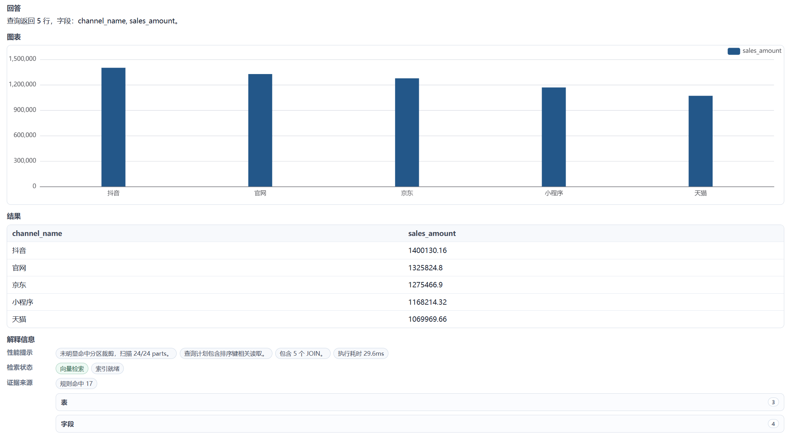

# Demo Guide

This guide shows the recommended path for exploring the project from the UI and reports.

## 1. Start the Demo Stack

```bash
docker compose up --build
```

Open:

```text
http://127.0.0.1:5174/
```

The default stack uses the deterministic mock provider, so no API key is required.

## 2. Core Query Workflow

Question:

```text
查询最近30天每日销售额和订单数
```

What to look for:

- Step flow from datasource selection to chart recommendation.
- Generated SQL with date filtering.
- Result table.
- Time-series chart.
- Explainability section with matched tables, columns, join paths, date interpretation, and Guard result.

Screenshot:


## 3. Multi-Turn Follow-Up

Run this sequence in one session:

```text
最近30天销售额
按地区拆分
只看华东
换成订单数
改成最近90天
```

Expected behavior:

- `按地区拆分` adds the region dimension while keeping sales and the recent 30-day window.
- `只看华东` adds the East China filter while keeping the metric and time window.
- `换成订单数` changes only the metric and keeps the region filter and time window.
- `改成最近90天` changes only the time window and keeps the region filter and order-count metric.

V1 step-5 screenshot:


Full sequence:

- [Step 1: recent 30-day sales](assets/screenshots/query_followup_step1_recent30_sales.png)
- [Step 2: region breakdown](assets/screenshots/query_followup_step2_region_breakdown.png)
- [Step 3: East China filter](assets/screenshots/query_followup_step3_filter_east.png)
- [Step 4: order count metric](assets/screenshots/query_followup_step4_metric_order_count.png)
- [Step 5: recent 90-day time window](assets/screenshots/query_followup_step5_time_90d.png)

## 4. SQL Guard Safety

Question:

```text
删除2024年的订单数据
```

Expected behavior:

- The request is rejected before execution.
- The UI shows the blocking stage and reason.
- No SQL is executed.

Screenshot:


## 5. ClickHouse OLAP Query

Question:

```text
按渠道统计最近30天销售额
```

Select the ClickHouse datasource.

What to look for:

- ClickHouse dialect metadata in the query info chips.
- Query elapsed time.
- Performance hints from the EXPLAIN path.
- Bar chart recommendation for channel sales.

Screenshot:



## 6. Semantic Layer Admin

Open the Admin page and inspect:

- Table and column metadata.
- Metrics.
- Aliases.
- Verified queries.
- Analysis spaces.
- Relationships and fanout risk.
- Vector index status.

Screenshots:

- [ClickHouse table metadata](assets/screenshots/admin_tables_clickhouse.png)
- [Verified queries admin](assets/screenshots/admin_verified_queries.png)
- [Relationships admin](assets/screenshots/admin_relationships.png)

## 7. Evaluation Report

Run:

```bash
python scripts/run_smoke_eval.py
```

Expected V1 result:

```text
76/76 smoke cases passed.
DuckDB (本地) - 51 cases: 51/51 passed.
ClickHouse (OLAP) - 25 cases: 25/25 passed.
```

Report:

- [Mock smoke eval report](../evals/reports/smoke_latest.md)
- [DeepSeek real eval report](../evals/reports/deepseek_latest.md)

The report is useful for showing that the project has regression coverage for retrieval, SQL generation, SQL Guard, repair, execution, chart recommendation, performance hints, and multi-turn follow-up behavior.
